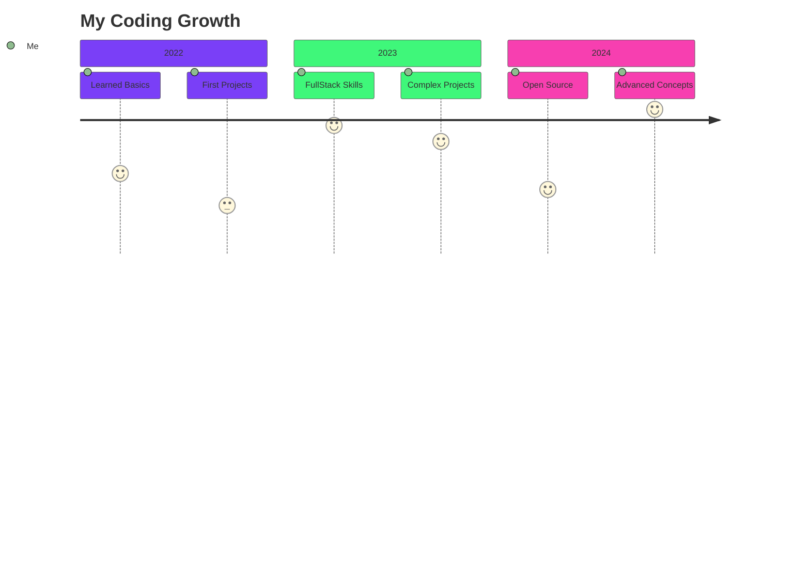

<h1 align="center">
  
</h1>

<p align="center">
  <a href="https://github.com/Adit122022?tab=repositories">
    
  </a>
</p>

## 🎥 Just Me

<div align="center">
  
  
  ```javascript
  const aditya = {
    pronouns: "he/him",
    currentFocus: "Next.js + TypeScript",
    yearlyCommitGoal: "2000+ commits",
    funFact: "My code once fixed itself while I was sleeping"
  };
  ```
</div>

## 📈 GitHub Growth Metrics

<div align="center">

### Contribution Evolution


### Repository Growth
<div style="display: flex; justify-content: center; gap: 10px; flex-wrap: wrap;">
  
  
</div>

</div>

## 🛠 Tech Stack

<div align="center" style="display: flex; justify-content: center; flex-wrap: wrap; gap: 8px;">
  
  
  
  
  
  
  
</div>

## 😂 Daily Dev Meme

<div align="center">
  
  <br/>
  <sub><i>Powered by Cat-as-a-Service API</i></sub>
</div>

## 🚀 My GitHub Journey



## 📊 Stats Dashboard

<div align="center">

| Metric | Growth |
|--------|--------|
| **Total Contributions** |  |
| **Commit Streak** |  |
| **Repository Stars** |  |
| **Lines of Code** |  |

</div>

## 💬 Let's Connect

<p align="center" style="display: flex; justify-content: center; gap: 10px; flex-wrap: wrap;">
  <a href="https://linkedin.com/in/aditya-sharma-82562a2a9">
    
  </a>
  <a href="mailto:adity122022@gmail.com">
    
  </a>
  <a href="https://portfolio-1-rchm.vercel.app/">
    
  </a>
  <a href="https://leetcode.com/adity122022">
    
  </a>
</p>

<div align="center">

## 🐍 Contribution Snake


</div>


